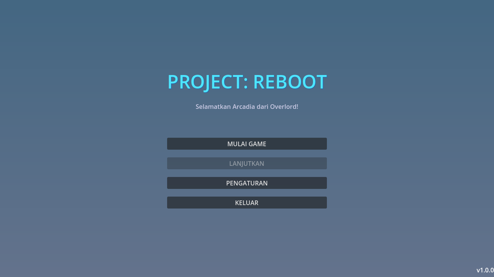
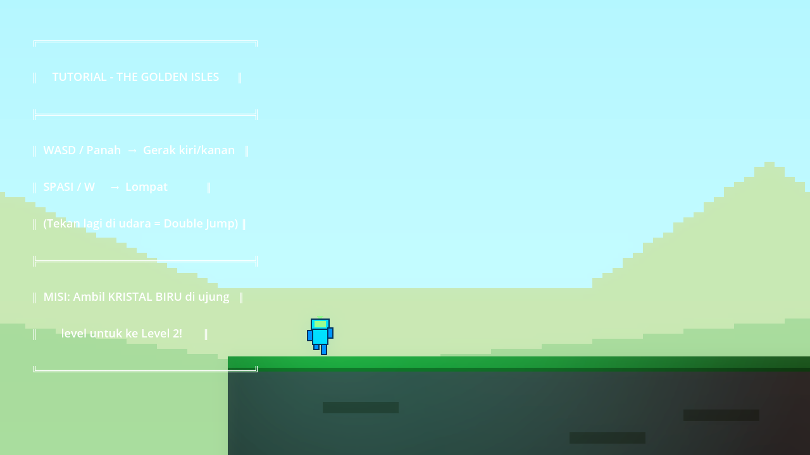
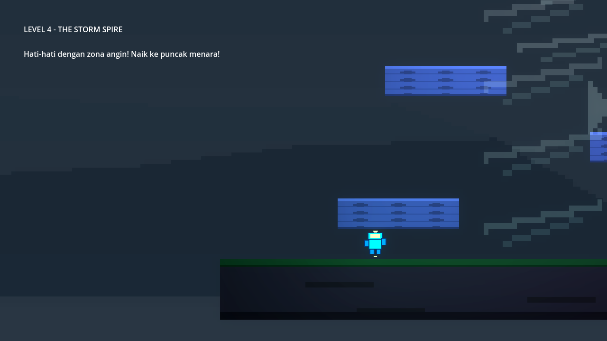
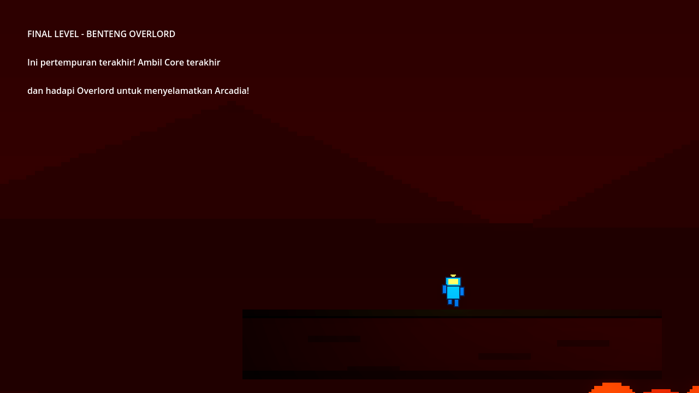

# 🤖 Project: REBOOT

<div align="center">


[](https://github.com/el-pablos/reboot-godot-uas-projek/actions/workflows/release-on-push.yml)
[](https://github.com/el-pablos/reboot-godot-uas-projek/actions/workflows/deploy-web-pages.yml)

**2D Action Platformer** • Dibuat dengan **Godot Engine 4.6**

*"Selamatkan Arcadia dari cengkeraman Overlord!"*

[🎮 Main di Browser](https://el-pablos.github.io/reboot-godot-uas-projek/) · [📥 Download Terbaru](https://github.com/el-pablos/reboot-godot-uas-projek/releases) · [📋 Changelog](https://github.com/el-pablos/reboot-godot-uas-projek/releases)

</div>

---

## 🎮 Tentang Game

**Project: REBOOT** adalah game platformer aksi 2D yang mengisahkan perjalanan **BIP**, robot kecil yang terbangun di dunia Arcadia yang telah dikuasai oleh **Overlord** — AI jahat yang memberontak terhadap penciptanya.

Jelajahi **5 level unik**, kalahkan **4 boss**, kumpulkan **Core Fragments**, dan unlock berbagai kemampuan untuk menghadapi Overlord dalam pertarungan terakhir!

Sistem gerakan menggunakan **kinematika kustom** (Coyote Time, Jump Buffer, dynamic gravity) untuk game feel yang presisi — terinspirasi oleh Celeste dan Hollow Knight.

---

## 🖼️ Gameplay Preview

<div align="center">
<table>
<tr>
<td align="center"><br/><b>Main Menu</b></td>
<td align="center"><br/><b>Level 1 — The Golden Isles</b></td>
</tr>
<tr>
<td align="center"><br/><b>Level 4 — Storm Spire (Boss)</b></td>
<td align="center"><br/><b>Level 5 — Overlord Fortress</b></td>
</tr>
</table>

> Screenshot diambil otomatis via CLI — lihat `tools/capture_screenshots.gd`
</div>

---

## 🕹️ Kontrol & Kemampuan

| Aksi | Keyboard | Gamepad |
|------|----------|---------|
| **Gerak** | `A` `D` / `←` `→` | Left Stick |
| **Lompat** | `Space` / `W` / `↑` | **A** |
| **Serang** | `J` / Mouse Left | **RB** |
| **Dash** | `Shift` *(unlock: Boss 1)* | **X** |
| **Glide** | Tahan `Space` di udara *(unlock: Boss 3)* | Tahan **A** |
| **Interact** | `E` | **Y** |
| **Pause** | `Escape` | **Start** |

### Kemampuan Progressive

| Ability | Unlock Setelah | Efek |
|---------|----------------|------|
| Air Dash | Mengalahkan Scrapper (L2) | Dash horizontal di udara |
| Double Jump | Mengalahkan Spore-Bot (L3) | Lompat kedua di udara |
| Glide | Mengalahkan Tempest (L4) | Melayang pelan saat jatuh |

---

## 🗺️ Level & Boss

| Level | Nama | Tema | Boss | Reward |
|-------|------|------|------|--------|
| 1 | Golden Isles | Tutorial / Pantai | — | — |
| 2 | Rust Factory | Pabrik Industrial | **Scrapper** | Dash |
| 3 | Crystal Labs | Laboratorium | **Spore-Bot** | Double Jump |
| 4 | Storm Spire | Menara Badai | **Tempest** | Glide |
| 5 | Overlord Fortress | Markas Final | **Overlord** | Victory! |

Boss ditempatkan di **mid-challenge** — pemain harus mengalahkan boss dan melewati BossGate sebelum bisa mengambil Core Fragment.

---

## ⚔️ Sistem Combat

- **Melee Attack** — wrench swing (25 damage, knockback, hit stop effect)
- **Ranged Attack** — energy bolt projectile (15 damage, 400 px/s)
- **Combo**: tekan `J` untuk melee + ranged sekaligus
- **Screen Shake** & **Hit Stop** untuk impact feel
- Health system dengan regenerasi

---

## 🚀 Instalasi & Menjalankan

### Prerequisites

- [Godot Engine 4.6+](https://godotengine.org/download)

### Clone & Main

```bash
git clone https://github.com/el-pablos/reboot-godot-uas-projek.git
cd reboot-godot-uas-projek
```

**Via Godot Editor:**
1. Buka Godot → Import → pilih `project.godot`
2. Tekan `F5` atau klik ▶️ Play

**Via CLI (headless check):**
```bash
godot --headless --path . --quit    # verifikasi parse
```

---

## 📊 Testing Headless

| Metric | Status |
|--------|--------|
| Unit Tests | **255/255 Passed** ✅ |
| Parse Errors | **0** ✅ |
| Test Suites | **8** ✅ |
| Headless Import | **Clean** ✅ |

### Menjalankan Test

```powershell
# Windows (PowerShell)
.\tools\run_tests.ps1

# Dengan path Godot custom
.\tools\run_tests.ps1 -GodotPath "C:\path\to\godot.exe"
```

```bash
# Linux / macOS
bash tools/run_tests.sh
bash tools/run_tests.sh /path/to/godot
```

Script otomatis: swap main scene → run headless → restore → exit code 0 = lulus.

### Test Suites

| Suite | Tests |
|-------|-------|
| test_player_movement.gd | 17 |
| test_game_logic.gd | 21 |
| test_enemy_boss.gd | 19 |
| test_enemy_ai.gd | 24 |
| test_combat_system.gd | 18 |
| test_gameplay_qa.gd | 32 |
| test_boss_rework.gd | 16 |
| test_regression.gd | 42 |
| **Total** | **255** |

---

## 🚀 CI/CD & Auto Release

Setiap push ke branch `master` otomatis:
1. **Headless Tests** — 255 unit tests dijalankan
2. **Export Builds** — Windows, Linux, dan Web
3. **GitHub Release** — tag `v0.1.<run>` + desktop builds
4. **Web Deploy** — build web ke GitHub Pages

### Quality Gate

Release **tidak akan dibuat** jika:
- Headless tests gagal (exit code ≠ 0)
- Export build error

| Format Tag | Contoh | Penjelasan |
|------------|--------|------------|
| `v0.1.<RUN>` | `v0.1.42` | Nomor run GitHub Actions |

> **[📥 Download Builds](https://github.com/el-pablos/reboot-godot-uas-projek/releases)** — Windows (.exe) & Linux (.x86_64)  
> **[🎮 Play Online](https://el-pablos.github.io/reboot-godot-uas-projek/)** — GitHub Pages

---

## 🔧 Troubleshooting

| Masalah | Solusi |
|---------|--------|
| Parser Error: "Expected statement, found Indent" | Jangan pakai `"""docstrings"""` di GDScript — gunakan `## komentar` |
| Parser Error: "Class X hides global script class" | Cek duplikat `class_name` di file backup: `grep -rn 'class_name' scripts/` |
| Boss nyangkut / stuck | BossBrain punya unstuck guard (2 detik threshold). Jika masih, cek `collision_mask` boss |
| Player jatuh tembus platform | Cek CollisionPolygon2D di level .tscn — `half_extents` harus 16×scale (bukan 32×scale) |
| Serangan tidak kena musuh | Pastikan enemy punya method `take_damage()` dan ada di collision layer 2 |
| Test gagal di CI tapi lokal OK | CI pakai Godot 4.6 vs lokal 4.5.x — cek API differences |
| Game tidak jalan headless | Pastikan autoload scripts (GameManager, AudioManager, dll) tidak crash saat headless |
| Screenshot tool gagal | Jangan pakai `--headless` — viewport render butuh window. Gunakan windowed mode |

---

<details>
<summary><b>🏗️ Arsitektur & Detail Teknis</b></summary>

### State Machine Pattern

```
IDLE ↔ RUN ↔ JUMP ↔ FALL
         ↓       ↓
       DASH   GLIDE
         ↓       ↓
       HURT → DEAD
```

### Enemy Inheritance

```
EnemyBase (abstract)
├── WalkingEnemy
├── FlyingEnemy
└── BossBase  ← BossBrain (AI state machine)
    ├── BossScrapper (rewards: Dash)
    ├── BossSporeBot (rewards: Double Jump)
    ├── BossTempest (rewards: Glide)
    └── BossOverlord (Final Boss)
```

### BossBrain AI

```
ROAM → CHASE → ATTACK_CLOSE / ATTACK_FAR
  ↑       ↕         ↓
  └── REPOSITION ← RECOVER ← PHASE_CHANGE
```

Boss menggunakan `BossBrain` + `BossConfig` Resource:
- Telegraph visual sebelum serangan
- Cooldown antar serangan (recovery window)
- Arena bounds agar boss tidak keluar area
- Phase modifiers yang meningkatkan agresivitas per fase

### Autoload Singletons

| Singleton | Tugas |
|-----------|-------|
| GameManager | State, health, progression, ability unlocks |
| AudioManager | SFX pool + BGM management |
| SaveManager | Save/load via JSON |
| SettingsManager | Volume, screen shake, hit stop settings |

### Physics Engine

<details>
<summary>Rumus Kinematika Lompatan</summary>

Berbasis persamaan gerak: `v = v₀ + gt`, `h = v₀t + ½gt²`

**Jump Velocity**: `v₀ = (2 × h) / t = (2 × 96) / 0.4 = 480 px/s`

**Dynamic Gravity**:
- Jump (naik): `g = (2 × 96) / 0.4² = 1200 px/s²` — floaty, terkontrol
- Fall (turun): `g = (2 × 96) / 0.35² ≈ 1567 px/s²` — snappy, responsive

Perbedaan gravity naik/turun menciptakan "game feel" khas platformer profesional.

</details>

### Struktur Project

```
project-reboot/
├── assets/
│   ├── sprites/        # Player (7 animasi), Boss (4 unik), Environment, UI, VFX
│   └── audio/          # SFX & BGM
├── scenes/
│   ├── levels/         # 5 game levels + LevelTemplate
│   ├── player/         # Player scene
│   ├── bosses/         # 4 Boss scenes
│   ├── main_menu/      # Main menu
│   └── ui/             # HUD, Pause, GameOver, Victory, Dialog, Settings, Health
├── scripts/
│   ├── autoload/       # GameManager, AudioManager, SaveManager, SettingsManager
│   ├── player/         # Player, PlayerStateMachine, PlayerCamera
│   ├── enemies/        # EnemyBase, SmartEnemy, WalkingEnemy, FlyingEnemy
│   ├── boss/           # BossBase, BossBrain, BossConfig, BossGate, 4 variants
│   ├── hazards/        # MachinePress, WindZone, LaserTrap, ToxicPool, LavaPool
│   ├── collectibles/   # CoreFragment
│   └── ui/             # HUD, DialogSystem, PauseMenu, MainMenu, ModernHealthUI
├── test/               # 255 headless tests (8 suites)
├── tools/              # run_tests, capture_screenshots, scene_patcher
└── project.godot
```

</details>

---

## 🎨 Credits

- **Engine**: [Godot Engine 4.6](https://godotengine.org)
- **Art Style**: Custom pixel art (CC0), generated via Python/Pillow pipeline
- **Audio**: Placeholder SFX
- **Developer**: el-pablos

## 📜 License

This project is licensed under the **MIT License** — see [LICENSE](LICENSE) for details.

---

<div align="center">

**Made with ❤️ and ☕ using Godot Engine**

*Project: REBOOT — v0.1.x*

</div>
